# Equipment Failure Prediction using IoT Sensor data

> Data Science Experience is now Watson Studio. Although some images in this code pattern may show the service as Data Science Experience, the steps and processes will still work.

This IBM Pattern is intended for anyone who wants to experiment, learn, enhance and implement a new method for Predicting Equipment failure using IoT Sensor data. Sensors mounted on devices like IoT devices, Automated manufacturing like Robot arms, Process monitoring and Control equipment etc., collect and transmit data on a continuous basis which is Time stamped.
  
The first step would be to identify if there is any substantial shift in the performance of the system using Time series data generated by a single IoT sensor. For a detailed flow on this topic, you can refer to the [Change Point detection IBM Pattern](https://developer.ibm.com/code/journey/detect-change-points-in-iot-sensor-data/).
Once, a Change point is detected in one key operating parameter of the IoT equipment, then it makes sense to follow it up with a Test to predict if this recent shift will result in a failure of an equipment.  This Pattern is an end to end walk through of a Prediction methodology that utilizes multivariate IoT data to predict any failure of an equipment. Bivariate prediction algorithm – [Logistic Regression](https://simple.wikipedia.org/wiki/Logistic_Regression) is used to implement this Prediction. Predictive packages in Python 2.0 software is used in this Pattern with sample Sensor data loaded into the Data Science experience cloud.
  
All the intermediary steps are modularized and all code open sourced to enable developers to use / modify the modules / sub-modules as they see fit for their specific application
  
When you have completed this pattern, you will understand how to
  
*	Read IoT Sensor data stored in the Data base
*	Configure the features and target variables for Prediction model
*	Split the multivariate data into Train and Test datasets by configuring the ratio
*	Train the model using Logistic Regression and measure the Prediction accuracy
*	Score the Test data and measure Prediction accuracy
*	Evaluate the Model’s Predictive performance further by computing a Confusion matrix
*	Rerun experiments by changing the configuration parameters

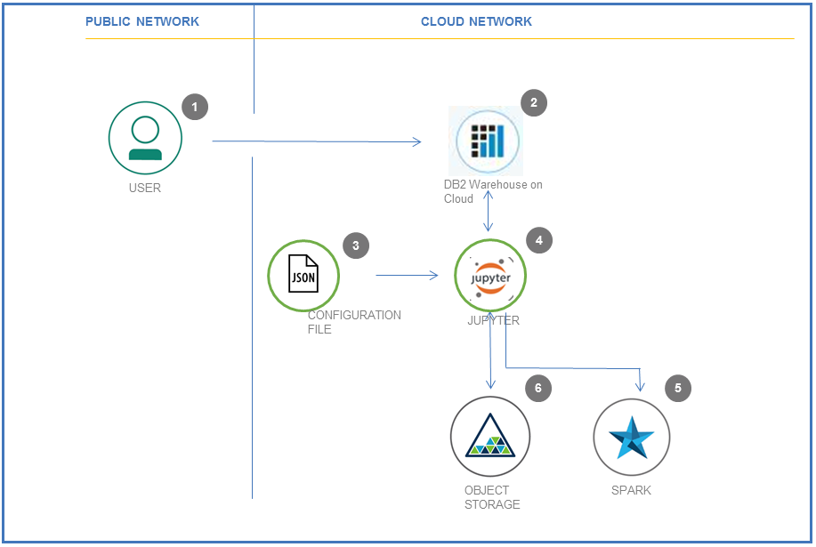

#### Steps:
1.	User signs up for IBM Watson Studio
2.	User loads the sample IoT sensor Time series data to database
3.	A configuration file holds all the key parameters for running the IoT Time series prediction algorithm
4.	The prediction algorithm written in Python 2.0 Jupyter notebook uses the Configuration parameters and Sensor data from DB
5.	Python Notebook runs on Spark in IBM Watson Studio to ensure performance and scalability
6.  The outputs of the prediction algorithm is saved in Object storage for consumption

#### Developers can reuse all components that support the above steps like
1.	Reading IoT Sensor data from DB
2.	Function to split Test and Train datasets, Build Logistic Regression models, Score models, Compute accuracy metrics like Confusion matrix
3.	User configurable features and target variables for Predicting equipment failures, Test and Train data sets
4.	Computations of key statistics that help evaluate the Predictive capability of the models
5.	Repeat the experiment by altering the Configuration parameters by rerunning the models

# Included Components

* [IBM Watson Studio](https://www.ibm.com/cloud/watson-studio): Analyze data using Python, Jupyter Notebook and RStudio in a configured, collaborative environment that includes IBM value-adds, such as managed Spark.
* [DB2 Warehouse on cloud](https://console.bluemix.net/catalog/services/db2-warehouse-on-cloud): IBM Db2 Warehouse on Cloud is a fully-managed, enterprise-class, cloud data warehouse service. Powered by IBM BLU Acceleration.
* [IBM Cloud Object Storage](https://console.ng.bluemix.net/catalog/services/object-storage/?cm_sp=dw-bluemix-_-code-_-devcenter): An IBM Cloud service that provides an unstructured cloud data store to build and deliver cost effective apps and services with high reliability and fast speed to market.

# Featured Technologies

* [Analytics](https://developer.ibm.com/code/technologies/analytics?cm=IBMCode-_--_-featured_technologies-_-analytics): Finding patterns in data to derive information.
* [Data Science](https://developer.ibm.com/code/technologies/data-science?cm=IBMCode-_--_-featured_technologies-_-data-science):Systems and scientific methods to analyze structured and unstructured data in order to extract knowledge and insights.

# Watch the Video  

# Steps

Follow these steps to setup and run this IBM Code Pattern. The steps are described in detail below.
1. [Sign up for Watson Studio](#1-sign-up-for-watson-studio)
2. [Create IBM Cloud services](#2-create-ibm-cloud-services)
3. [Create the Jupyter notebook](#3-create-the-jupyter-notebook)
4. [Add the data and configuraton file](#4-add-the-data-and-configuration-file)
5. [Run the notebook](#5-run-the-notebook)
6. [View the results](#6-view-the-results)

## 1. Sign up for Watson Studio

Sign up for IBM's [Watson Studio](https://dataplatform.cloud.ibm.com/). By signing up for Watson Studio, an Object Storage service will be created in your IBM Cloud account.  

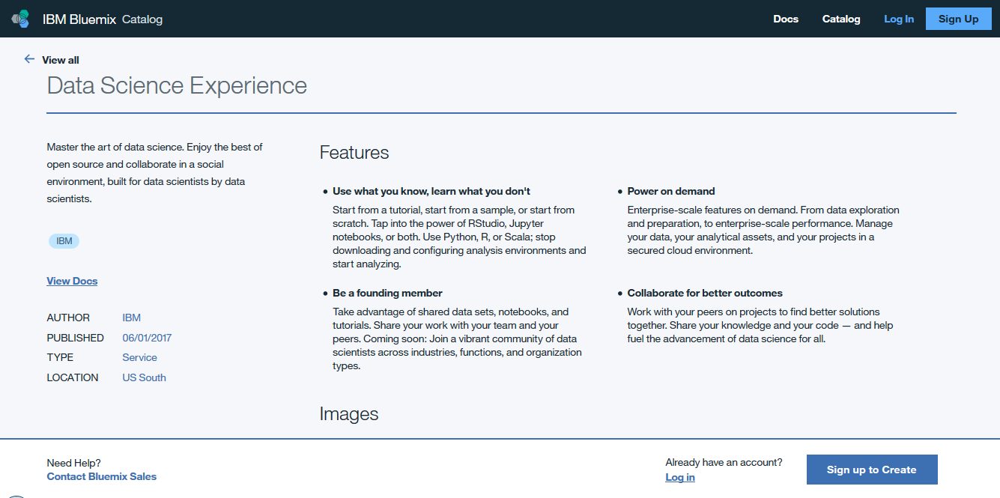  

## 2. Create IBM Cloud services

### 2.1 Download sample data  

Download the [sample data file](https://github.com/IBM/iot-predictive-analytics/blob/master/data/iot_sensor_dataset.csv) from github and store it in your a local folder. This will be used to upload to database in the next steps.

Once you are familiar with the entire flow of this Pattern, you can use your own data for analysis. But ensure that your data format is exactly same as provided in the sample data file.

### 2.2 Create a DB2 Warehouse on IBM Cloud

If you are not already familiar with how to create, access data from data store in Watson Studio, get yourself familiarised by following this documentation. [Add data to project](https://datascience.ibm.com/docs/content/manage-data/add-data-project.html)

Topics related to Data creation and access that will be specifically helpful in this Pattern are as below:

* [Create connections to databases](https://datascience.ibm.com/docs/content/manage-data/dw08.html)  
* [Load and access data in a notebook](https://datascience.ibm.com/docs/content/analyze-data/load-and-access-data.html?linkInPage=true)  
  
i. Click on ``DB2 Warehouse on Cloud`` service in the IBM Cloud Dashboard. Click ``Open`` to launch the Dashboard.
[DB2 Warehouse on Cloud](https://console.bluemix.net/catalog/services/db2-warehouse-on-cloud)  
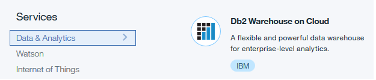  

  Note: Data will loaded into a DB2 database instead of reading directly from the .csv file.
  This is done to ensure end to end consistency of solution architecture when combined with other IoT IBM Patterns.  

ii.	Choose an appropriate name for the DB2 Warehouse ``Service Name`` and choose  ``Free`` Pricing Plan. Click on Create.
  
  
  
iii.	Click on DB2 Warehouse on cloud instance on ``IBM Cloud Dashboard``. You must be able to see the DB2 Warehouse service you created in the previous step. Click on the service name from the list. Once you are in the Service details page, click on ``Open`` button.
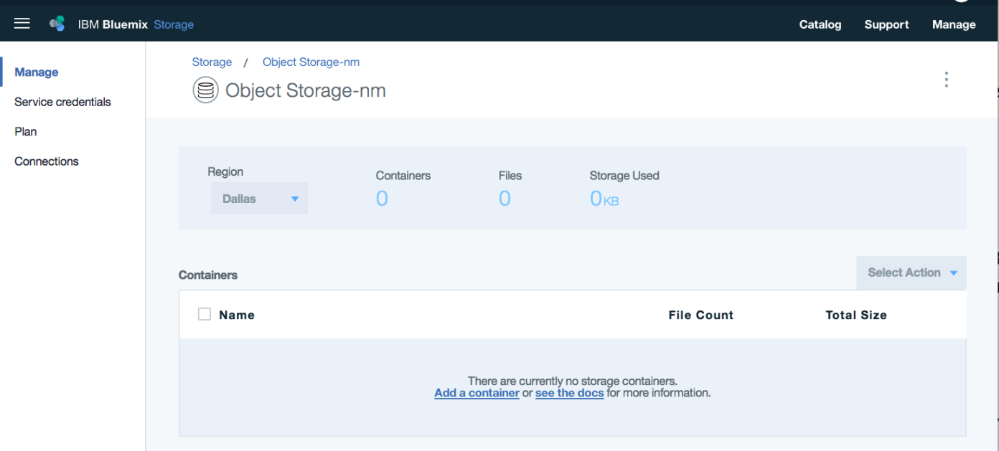  

iv.	``Load data`` which is downloaded in step 5.2.1 into a DB2 Warehouse table by selecting the sample data from ``My Computer -> browse files``.
    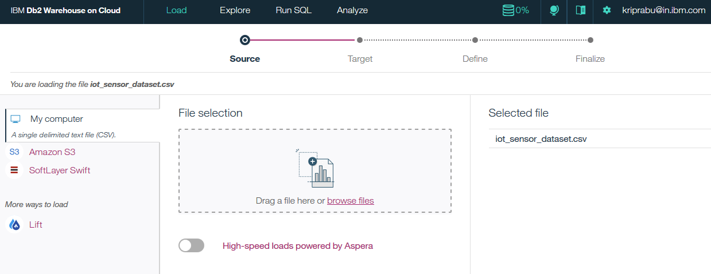
  
v.	Click on ``Next`` from the panel, choose schema and then create a ``New Table``.
    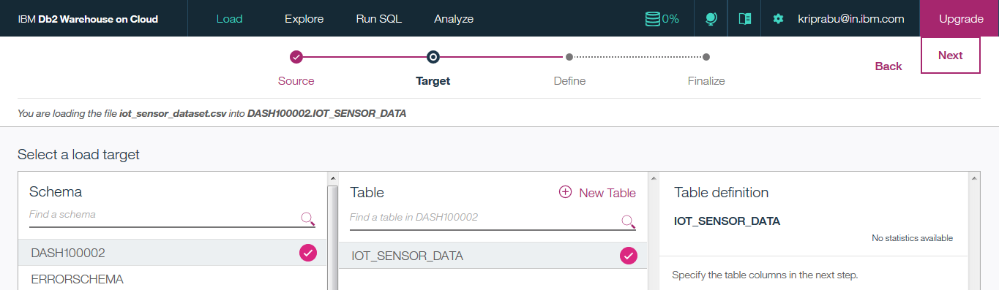

  * The screenshot above shows ``DASH100002`` as the Schema name. Select an appropriate schema name for which you have read / write access
  * It is important to specify the name of the DB2 table as IOT_SENSOR_DATA, as it will be referred in Data science experience to read data from in later steps

### 2.3 Create DB2 Warehouse Connection in Watson Studio  

We need to link the data we just uploaded into the DB2 Warehouse database with Watson Studio in order to run the analysis.  
Below are the steps to add a connection to access the data in Watson Studio Python Jupyter notebook.  

   i. Navigate to Watson Studio ``Project -> ViewAll Project -> pick your project``  
  ii. Choose ``Data Services -> Connections`` menu  
 iii. Click on the ``Create Connection`` button  

  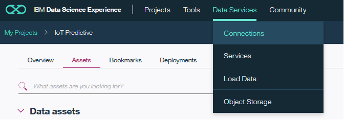  

  iv. Give a name for your Watson Studio Data connection  
   v. Choose ``Service instance`` as the name of the DB2 warehouse service name you created earlier and Click ``Create``  
   
  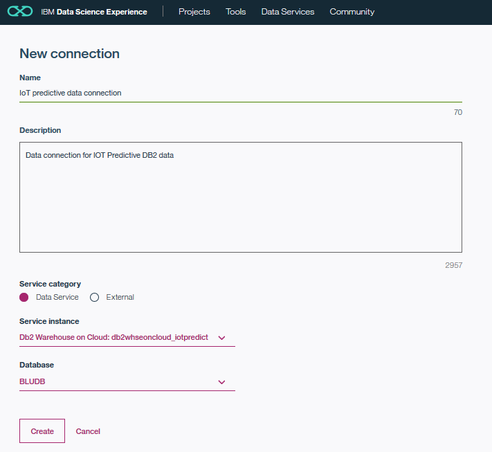  

  vi. Navigate back to ``Project -> ViewAll Project -> pick your project``  
 vii. Click on the Find and add data icon ``1010`` on top right  
viii. Click on ``Connection tab`` the check box next to the DB2 warehouse Data connection you just created and click ``Apply``  
  ix. Now the new connection is added to your Watson Studio IoT Predictive project  
  
  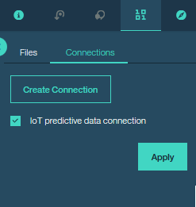  

## 3. Create the Jupyter notebook

First create a new project in Watson Studio. Follow the detailed steps provided in the [IBM online documentation for Watson Studio Project creation](https://datascience.ibm.com/docs/content/analyze-data/creating-notebooks.html), or watch a video on using [Watson Studio to create a project](https://youtu.be/QSttEjcHtl0).

In [Watson Studio](http://dataplatform.ibm.com/):

Use the menu on the top to select `Projects` and then `Default Project`. 
Click on `Add notebooks` (upper right) to create a notebook.

* Select the `From URL` tab.
* Enter a name for the notebook.
* Optionally, enter a description for the notebook.
* Enter this Notebook URL:
https://github.com/IBM/iot-predictive-analytics/blob/master/notebook/watson_iotfailure_prediction.ipynb
* Select the free Anaconda runtime.
* Click the `Create` button.
* Upload the sample .json, .txt Watson Studio configuration file to Watson Studio Object storage from URL below:  
    https://github.com/IBM/iot-predictive-analytics/blob/master/configuration/iotpredict_config.json  
    https://github.com/IBM/iot-predictive-analytics/blob/master/configuration/iotpredict_config.txt  

  To upload these files in Watson Studio object storage, 
   * Go to "My Projects -> Your Project Name"
   * Click on the ``Find and add data`` icon on top ribbon
   * Select the file and upload one by one  

   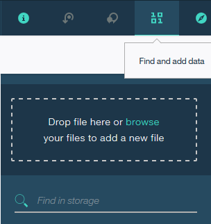  
  
  Now you must be able to see the uploaded files listed under "My Projects -> Your Project Name -> Assets"  tab  
  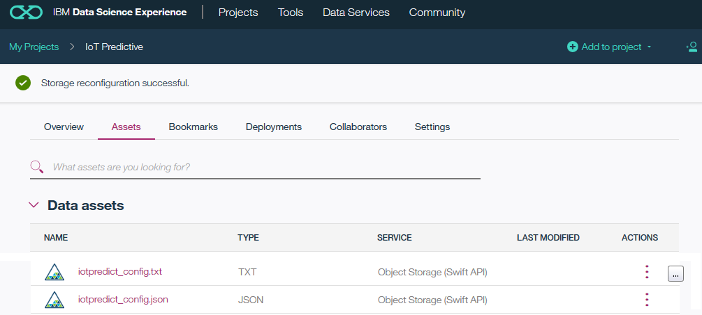
  
## 4. Add the data and configuraton file
Fix-up configuration parameter .json file name and values:

Go to the Notebook in Watson Studio by navigating to "My Projects -> IoT Predictive"
Under ``Assets`` tab, under ``Notebooks`` section you will find the Notebook you just imported
Click on the ``Click to Edit and Lock`` icon to edit the notebook in Jupyter notebook in Watson Studio  

For more details on Creating, Editing and sharing notebooks in IBM Watson Studio refer to [Notebooks Watson Studio documentation](https://datascience.ibm.com/docs/content/analyze-data/notebooks-parent.html)

You can now update the variables that refer to the .json configuration file name in the R - Jupyter Notebook.
This step is necessary only if you had changed the name of the sample .json configuration file you had uploaded earlier for any reason.  

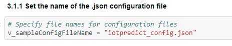

The default .json configuration file, you uploaded earlier works without any changes with the Sample data supplied.

But, if you have a data file with different column names and wanted to customise the model to use these column names you can do so. Below are the steps to configure the .json configuration file to train the Predictive models using your custom data file.

1. Download the [.json configuration file](https://github.com/IBM/iot-predictive-analytics/blob/master/configuration/iotpredict_config.json) to your Computer local folder  
2. Open a local copy of the .json file in text editor like notepad and edit the [Watson Studio configuration .json file](https://github.com/IBM/iot-predictive-analytics/blob/master/configuration/iotpredict_config.json)
3. Update the ``paramvalue`` ONLY (underlined in RED in image below) to suit your requirements and save the .json file. Retain the rest of the format and composition of the .json file
4. Delete the copy of 'iotpredict_config.json' in Watson Studio data store if one is already uploaded by you earlier.  
5. Now upload your local edited copy of 'iotpredict_config.json' by following the steps in section 5.3 above.  
    

    
The descriptions of the parameters that can be configured are as below.

i.	features: List of variable names that are independent ‘x’ variables for Prediction  
ii.	target: Target variable name that needs to be predicted ‘y’ with values in binary 1 or 0 form with 1 indicating a failure  
iii.	data_size: Percentage of sample data to be reserved for Testing in decimal form.
      Example: 0.7 indicates 70% of the data will be used for Training the model and 30% will be used as Test  data

* The cell 3.1.2 of the Jupyter Notebook has a function definition which is shown for illustration purposes.  
These details that have user specific security details are striked out in the screenshots shown below.  
This function will need to be recreated with your user specific access credentials ang target data object.  
In order to do that first delete all pre existing code in cell 3.1.2 of the notebook.  
  
Note: The .pynb file that you imported have code with dummy credentials for illustration purposes.  
This needs to be replaced by your user specific function with your own access credentials.  
The steps below explain that.  
  

* In section 3.1.2 of Jupyter Notebook (not this README file), Insert (replace) your own Object storage file credentials to read the 'iotpredict_config.txt' configuration file  
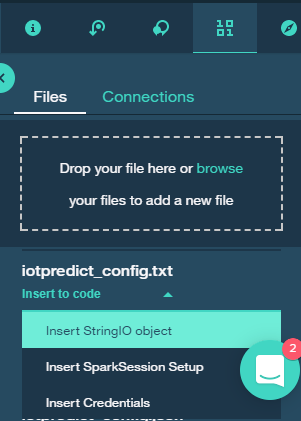  
  

* This step will auto generate a function that reads the data followed by a call to the function as below:  
   1. ``def get_object_storage_file_with_credentials_<alphanumeric characters>(container, filename):``  
   2. ``data_1 = get_object_storage_file_with_credentials_<alphanumeric characters>('IoTPredictive', 'iotpredict_config.txt')``   
Rename the function by removing the alphanumeric characters to "get_object_storage_file_with_credentials(container, filename)"  
Delete the second part, that calls the function and reads the data. This is done elsewhere in the code you have imported  
   
   
* Go to section 3.2 (cell In [7]) and do the following:
   1. Update the name of the function in section 3.2 of the Jupyter Notebook also to "get_object_storage_file_with_credentials()". 
   2. The container name used in the sample code is "IoTPredictive". Change the container name if it is different for you. 
      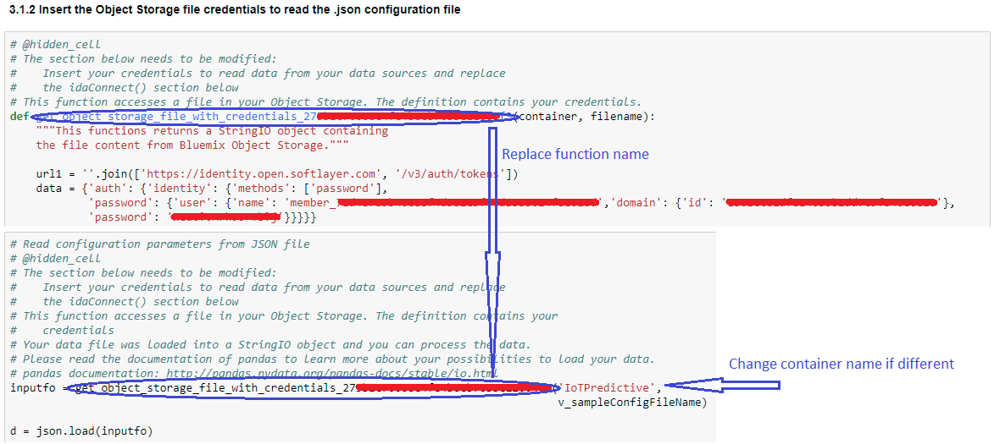  
   3. Update the second parameter ('iotpredict_config.txt' in sample code) to ``v_sampleConfigFileName``  
  The modified code in this cell should look like below,

  ``inputfo = get_object_storage_file_with_credentials('IoTPredictive', v_sampleConfigFileName)``  
  ``d = json.load(inputfo)``  

Refer to screen shot above for details.  
For more details, revisit the documentation help links provided in beginning of section 5.2.2  

#### Add the data and configuration to the notebook

Use ``Find and Add Data`` (look for the ``10/01`` icon) and its ``Connections`` tab. You must be able to see your database connection created earlier. From there you can click ``Insert to Code`` under the 'Data connection' list and add ibm DBR code with connection credentials to the flow.

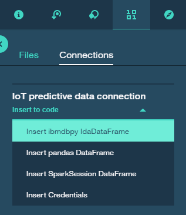

Note: If you don't have your own data and configuration files, you can reuse our example in the "Read IoT Sensor data from database" section. Look in the /data/iot_sensor_dataset.csv directory for data file.

## 5. Run the notebook
When a notebook is executed, what is actually happening is that each code cell in
the notebook is executed, in order, from top to bottom.

Each code cell is selectable and is preceded by a tag in the left margin. The tag
format is `In [x]:`. Depending on the state of the notebook, the `x` can be:

* A blank, this indicates that the cell has never been executed.
* A number, this number represents the relative order this code step was executed.
* A `*`, this indicates that the cell is currently executing.

There are several ways to execute the code cells in your notebook:

* One cell at a time.
  * Select the cell, and then press the `Play` button in the toolbar.
* Batch mode, in sequential order.
  * From the `Cell` menu bar, there are several options available. For example, you
    can `Run All` cells in your notebook, or you can `Run All Below`, that will
    start executing from the first cell under the currently selected cell, and then
    continue executing all cells that follow.
* At a scheduled time.
  * Press the `Schedule` button located in the top right section of your notebook
    panel. Here you can schedule your notebook to be executed once at some future
    time, or repeatedly at your specified interval.

## 6. View the results

The notebook outputs the results in the Notebook which can be copied to clipboard
The Training model Prediction accuracy is output in section 5.2
The overall prediction accuracy is output as a percentage

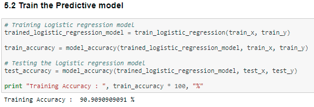  

If you are satisfied with the Training model accuracy, you can proceed further for scoring the Test data using the Trained model and analyze the results  
The Confusion matrix is computed on the results of the Testing for a dep dive understanding of the Model performance  

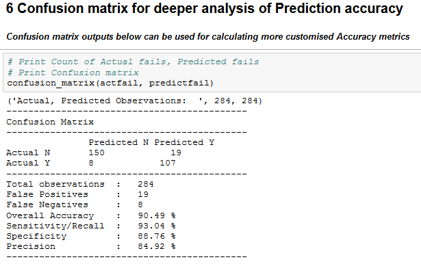  

Overall accuracy percentage gives the overall Prediction performance of the model.  
Sensitivity and Specificity of the model is also calculated along with absolute values of False positives and False Negatives to give the Data Scientist / Analyst an idea of predictive accuracy in the model.  
It can be checked if these are within thresholds for the specific application of the model or IoT equipment.  
  
# Troubleshooting

[See DEBUGGING.md](DEBUGGING.md)
  
# License

This code pattern is licensed under the Apache Software License, Version 2.  Separate third party code objects invoked within this code pattern are licensed by their respective providers pursuant to their own separate licenses. Contributions are subject to the [Developer Certificate of Origin, Version 1.1 (DCO)](https://developercertificate.org/) and the [Apache Software License, Version 2](http://www.apache.org/licenses/LICENSE-2.0.txt).

[Apache Software License (ASL) FAQ](http://www.apache.org/foundation/license-faq.html#WhatDoesItMEAN)
