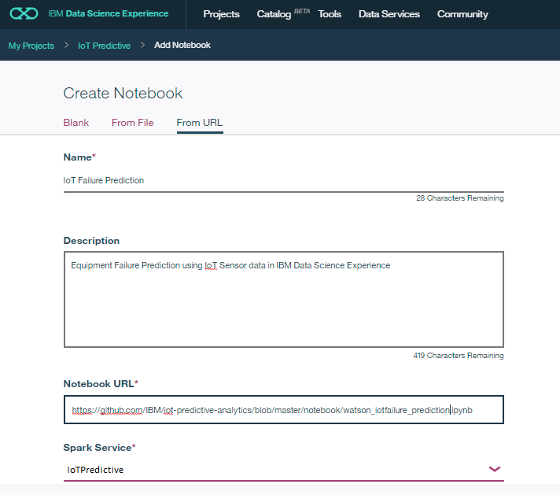
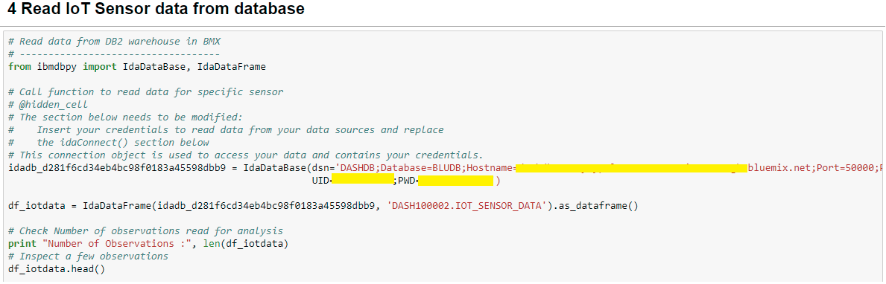

# 1 Equipment Failure Prediction using IoT Sensor data

This developer journey is intended for anyone who wants to experiment, learn, enhance and implement a new method for Predicting Equipment failure using IoT Sensor data. Sensors mounted on devices like IoT devices, Automated manufacturing like Robot arms, Process monitoring and Control equipment etc., collect and transmit data on a continuous basis which is Time stamped.
  
The first step would be to identify if there is any substantial shift in the performance of the system using Time series data generated by a single IoT sensor. For a detailed flow on this topic, you can refer to the [Change Point detection Developer Journey](https://developer.ibm.com/code/journey/detect-change-points-in-iot-sensor-data/).
Once, a Change point is detected in one key operating parameter of the IoT equipment, then it makes sense to follow it up with a Test to predict if this recent shift will result in a failure of an equipment.  This journey is an end to end walk through of a Prediction methodology that utilizes multivariate IoT data to predict any failure of an equipment. Bivariate prediction algorithm – Logistic Regression is used to implement this Prediction. Predictive packages in Python 2.0 software is used in this Journey with sample Sensor data loaded into the Data Science experience cloud.
  
All the intermediary steps are modularized and all code open sourced to enable developers to use / modify the modules / sub-modules as they see fit for their specific application
  
When you have completed this journey, you will understand how to
  
*	Read IoT Sensor data stored in the Data base
*	Configure the features and target variables for Prediction model
*	Split the multivariate data into Train and Test datasets by configuring the ratio
*	Train the model using Logistic Regression and measure the Prediction accuracy
*	Score the Test data and measure Prediction accuracy
*	Evaluate the Model’s Predictive performance further by computing a Confusion matrix
*	Rerun experiments by changing the configuration parameters

#### Steps:
1.	User signs up for IBM Data Science experience
2.	User loads the sample IoT sensor Time series data to database
3.	A configuration file holds all the key parameters for running the IoT Time series prediction algorithm
4.	The prediction algorithm written in Python 2.0 Jupyter notebook uses the Configuration parameters and Sensor data from DB
5.	The outputs of the prediction algorithm is saved in Object storage for consumption

#### Developers can reuse all components that support the above steps like
1.	Reading IoT Sensor data from DB
2.	Function to split Test and Train datasets, Build Logistic Regression models, Score models, Compute accuracy metrics like Confusion matrix
3.	User configurable features and target variables for Predicting equipment failures, Test and Train data sets
4.	Computations of key statistics that help evaluate the Predictive capability of the models
5.	Repeat the experiment by altering the Configuration parameters by rerunning the models

# 2	Included Components

* [IBM Data Science Experience](https://www.ibm.com/bs-en/marketplace/data-science-experience): Analyze data using Python, Jupyter Notebook and RStudio in a configured, collaborative environment that includes IBM value-adds, such as managed Spark.
* [DB2 Warehouse on cloud](https://console.bluemix.net/catalog/services/db2-warehouse-on-cloud): IBM Db2 Warehouse on Cloud is a fully-managed, enterprise-class, cloud data warehouse service. Powered by IBM BLU Acceleration.
* [Bluemix Object Storage](https://console.ng.bluemix.net/catalog/services/object-storage/?cm_sp=dw-bluemix-_-code-_-devcenter): A Bluemix service that provides an unstructured cloud data store to build and deliver cost effective apps and services with high reliability and fast speed to market.

# 3	Featured Technologies

* [Analytics](https://developer.ibm.com/code/technologies/analytics?cm=IBMCode-_--_-featured_technologies-_-analytics): Finding patterns in data to derive information.
* [Data Science](https://developer.ibm.com/code/technologies/data-science?cm=IBMCode-_--_-featured_technologies-_-data-science):Systems and scientific methods to analyze structured and unstructured data in order to extract knowledge and insights.

# 4	Watch the Video
[Video Coming soon](Coming soon video url)

# 5 Steps

Follow these steps to setup and run this developer journey. The steps are described in detail below.
1. [Sign up for the Data Science Experience](#1-sign-up-for-the-data-science-experience)
2. [Create Bluemix services](#2-create-bluemix-services)
3. [Create the Jupyter notebook](#3-create-jupyter-notebook)
4. [Add the data and configuraton file](#4-add-data-config-file)
5. [Run the notebook](#5-run-notebook)
6. [Download the results](#6-download-results)

## 5.1	Sign up for the Data Science Experience

Sign up for IBM's [Data Science Experience](http://datascience.ibm.com/). By signing up for the Data Science Experience, two services: DSX-Spark and DSX-ObjectStore will be created in your Bluemix account.  

## 5.2	Create Bluemix services
Create the Bluemix services by following the links below.
[Object Storage in Bluemix](https://console.ng.bluemix.net/catalog/services/object-storage)

  i.	Choose an appropriate name for the DB2 Warehouse Service Name and choose Free Pricing Plan. Click on Create.
  
  
  
  ii.	Click on Object Storage service instance on Bluemix Dashboard. Choose the region and create a Container unit using Add a container link.  

  
  iii.	Upload the [sample data file](https://github.com/IBM/iot-predictive-analytics/blob/master/data/iot_sensor_dataset.csv) in Object storage Container.

  
* [DB2 Warehouse on Cloud](https://console.bluemix.net/catalog/services/db2-warehouse-on-cloud)  
  
  
    i.	Once service is created, click on DB2 Warehouse on Cloud service instance on Bluemix Dashboard. Click Open to launch the Dashboard.
    ii.	Load data into the DB2 Warehouse by selecting the sample data from My Computer -> browse files.
    
    iii.	Click on Next from the panel, choose schema and then create a New Table.
    

* [**Data Science Experience**](https://console.bluemix.net/catalog/services/data-science-experience)  
  

## 5.3	Create the Python Jupyter Notebook
Use the menu on the left to select My Projects and then Default Project. Click on Add notebooks (upper right) to create a notebook.
*	Select the From URL tab.
*	Enter a name for the notebook.
*	Optionally, enter a description for the notebook.
*	Enter this Notebook URL:
https://github.com/IBM/iot-predictive-analytics/blob/master/notebook/watson_iotfailure_prediction.ipynb
*	Click the Create Notebook button.
    
* Upload the sample .json DSX configuration file to Object storage from URL:
    https://github.com/IBM/iot-predictive-analytics/blob/master/configuration/iotpredict_config.json

## 5.4	Add the configuration and data access details
Fix-up configuration parameter .json file name and values
Once the files have been uploaded into DSX-ObjectStore you need to update the variables that refer to the .json configuration files in the R - Jupyter Notebook.
In the notebook, update the DSX configuration .json file name in section 3.1.1 
  

  
Edit the [DSX configuration .json file](https://github.com/IBM/iot-predictive-analytics/blob/master/configuration/iotpredict_config.json)
Update the paramvalue ONLY to suit your requirements and save the .json file
Retain the rest of the format and composition of the .json file
  

    
The descriptions of the parameters that can be configured are as below.

i.	features: List of variable names that are independent ‘x’ variables for Prediction  
ii.	target: Target variable name that needs to be predicted ‘y’ with values in binary 1 or 0 form with 1 indicating a failure  
iii.	data_size: Percentage of sample data to be reserved for Testing in decimal form.
      Example: 0.7 indicates 70% of the data will be used for Training the model and 30% will be used as Test  data

* In section 3.1.2 of DSX notebook, Insert (replace) your own Object storage file credentials to read the .json configuration file
* Also replace the function name in the block that Read json configuration file in section 3.2

Note: If you don't have your own data and configuration files, you can reuse our example in the "Read IoT Sensor data from database" section. Look in the /data/iot_sensor_dataset.csv directory for data file.

# 6	Run the notebook
When a notebook is executed, what is actually happening is that each code cell in
the notebook is executed, in order, from top to bottom.

Each code cell is selectable and is preceded by a tag in the left margin. The tag
format is `In [x]:`. Depending on the state of the notebook, the `x` can be:

* A blank, this indicates that the cell has never been executed.
* A number, this number represents the relative order this code step was executed.
* A `*`, this indicates that the cell is currently executing.

There are several ways to execute the code cells in your notebook:

* One cell at a time.
  * Select the cell, and then press the `Play` button in the toolbar.
* Batch mode, in sequential order.
  * From the `Cell` menu bar, there are several options available. For example, you
    can `Run All` cells in your notebook, or you can `Run All Below`, that will
    start executing from the first cell under the currently selected cell, and then
    continue executing all cells that follow.
* At a scheduled time.
  * Press the `Schedule` button located in the top right section of your notebook
    panel. Here you can schedule your notebook to be executed once at some future
    time, or repeatedly at your specified interval.

# 7	View the results
The notebook outputs the results in the Notebook which can be copied to clipboard
The Training model Prediction accuracy is output in section 5.2
The overall prediction accuracy is output as a percentage

  

If you are satisfied with the Training model accuracy, you can proceed further for scoring the Test data using the Trained model and analyze the results
The Confusion matrix is computed on the results of the Testing for a dep dive understanding of the Model performance

Overall accuracy percentage gives the overall Prediction performance of the model.
The False positives and False Negatives are also listed to give the user an idea of the errors in the model. It can be checked if these are within thresholds for the specific application of the model or IoT equipment.
  
# 8 Troubleshooting

[See DEBUGGING.md](DEBUGGING.md)
  
# 9 License

[Apache 2.0](LICENSE)
